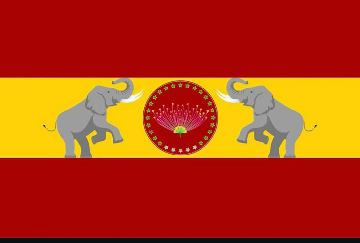
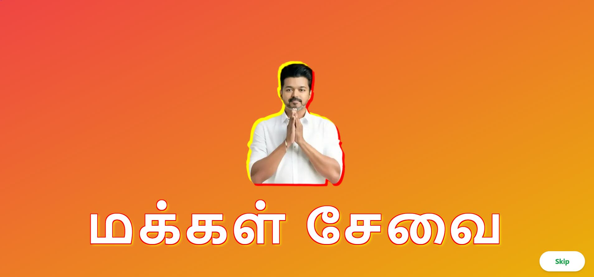
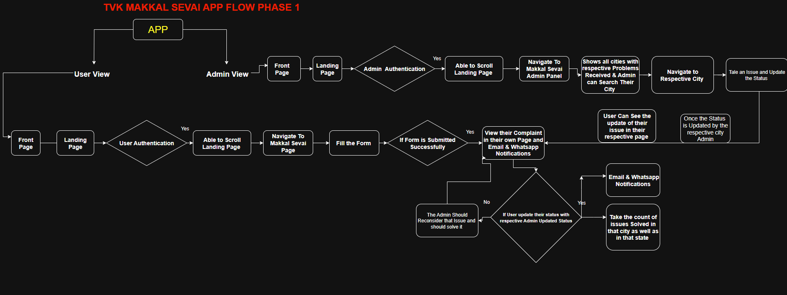

<h1>
  
  MAKKAL SEVAI — TVK-Makkal Sevai
</h1>

<p align="center">
    
</p>

<div style="margin-top:10px" align="center">
  
  
  
  
  
  
  
  
  
  
</div>

<div align="center">
  <h2>
<strong>MAKKAL SEVAI</strong> is a civic-grade web application designed to bridge the gap between the people (<em>Makkal</em>) and the TVK team. It blends secure document workflows, AI-powered assistance, and interactive data visualizations to deliver a transparent, emotionally resonant experience for Tamil Nadu citizens.
  </h2>
  <h3><a href="https://tvk-makkal-sevai.vercel.app/" target="_blank"><strong> Explore the Civic Platform</strong></a></h3>
</div>

---

## 📋 Table of Contents

1. [Introduction](#-introduction)
2. [Technical Description](#-technical-description)
3. [Tech Stack](#-tech-stack)
4. [Features](#-features)
5. [Quick Start](#-quick-start)
6. [Installation](#-installation)
7. [Development](#-development)
8. [Production Build](#-production-build)
9. [Deployment](#-deployment)
10. [License](#-license)
11. [Acknowledgements](#-acknowledgements)

---

### 🚀 Introduction

**TVK-Makkal Sevai** is a civic-grade React application that empowers citizens to submit documents, receive updates, and interact with AI-powered assistants in Tamil and English.  
It’s built for resilience, clarity, and emotional resonance — with Kafka-powered event flows and Appwrite backend integration.

---

### 🧠 Technical Description

MAKKAL SEVAI is engineered for civic transparency and reviewer delight:

- **KafkaJS** for event-driven, non-blocking workflows.
- **Appwrite** for secure backend services.
- **Anthropic & OpenAI SDKs** for multilingual AI assistance.
- **EmailJS** for confirmation and status updates.
- **React PDF & Doc Viewer** for inline document rendering.
- **Nivo Pie Charts** for visual analytics.
- **Leaflet & Globe.gl** for geospatial mapping.

#### **Core Architecture**

- **Frontend**: React 19 + Vite 7       
- **Styling**: Tailwind CSS + Tailwind Merge
- **Animation**: GSAP + Framer Motion
- **Auth & Backend**: Appwrite
- **AI Integration**: Anthropic & OpenAI
- **Visualization**: Nivo, Leaflet, Globe.gl
- **Deployment**: Vercel / Docker

<p align="center">
  
</p>

---

### 🔧 Tech Stack (Summary)

- ⚛ **React 19**
- ⚡ **Vite 7**
- 🌈 **Tailwind CSS 3.3**
- 🌀 **GSAP / Framer Motion**
- 📊 **Nivo Pie / Globe.gl / Leaflet**
- 📧 **EmailJS**
- 🔐 **Appwrite**
- 🧠 **OpenAI / Anthropic SDK**
- 🗂️ **React PDF / Doc Viewer**
- 🛰️ **KafkaJS**
- ☁ **Vercel / Docker**

---

## ⚙ Features

- 🧠 **Multilingual AI Assistant (Tamil + English)**
- 📄 **Inline Document Viewer (PDF, DOCX)**
- 📊 **Real-time Pie Charts & Geo Mapping**
- 🔐 **Secure Appwrite Authentication**
- 📧 **Email Confirmation & Status Updates**
- 🛰️ **Kafka-powered Event Flows**
- 🎉 **Confetti & CountUp Animations**
- 🛡 **Custom 404 Error Page**
- 🌍 **Globe-based Civic Data Visualizer**

---

## ⚡ Quick Start

### 📦 Prerequisites

- Node.js ≥ 18
- npm / yarn / pnpm

---

## 🛠 Installation

```bash
git clone https://github.com/KarthickRamAlagar/tvk-makkal-sevai.git
npm install

```

## Development

```bash
npm run dev
```

### Your app will run at:

```bash
http://localhost:5173
```

## Production Build

```bash
npm run build
```

## Preview build

```bash
npm run preview
```

## 🪪 License

MIT License

## 🙏 Acknowledgements

<p align="center">
  
  
  
  
  
  
  
  
  
  
  
  
  
  
</p>
